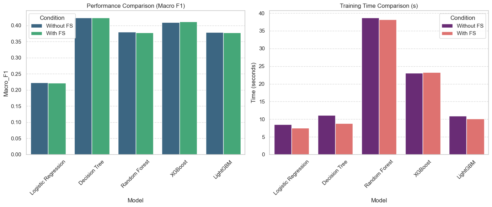
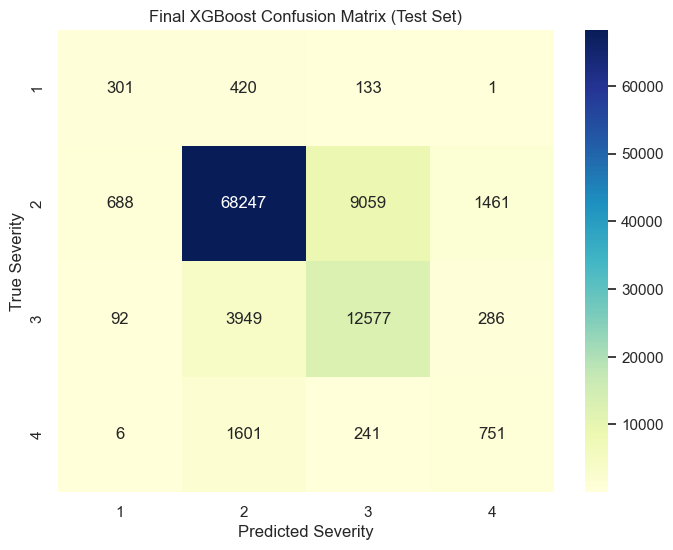
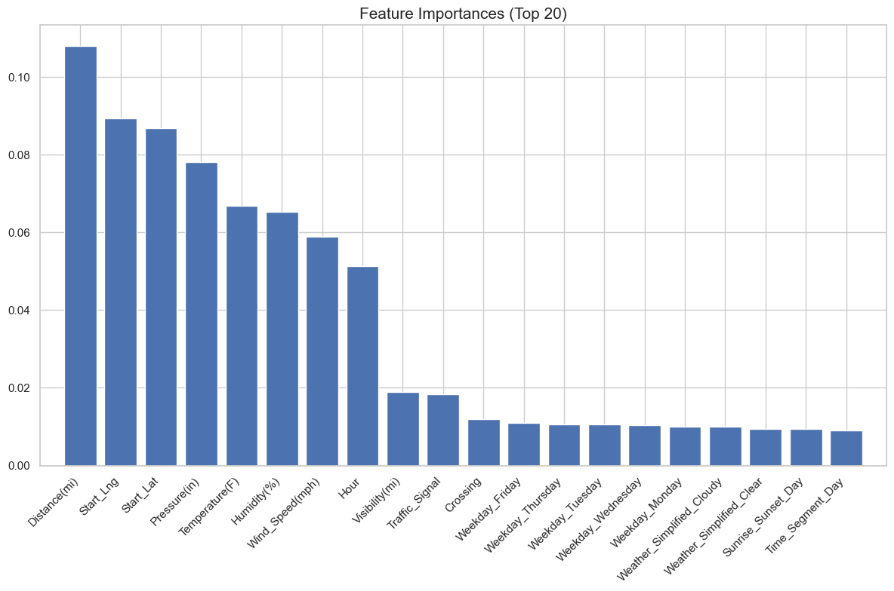

# U.S. Accident Traffic Impact Classification

Machine-learning classification of traffic-disruption impact using 500,000 U.S. accident records and cost-sensitive XGBoost.

## Overview

This project was developed as an individual term project for a Machine Learning course.

The goal was to analyze large-scale U.S. traffic accident data and classify the level of traffic disruption caused by an accident using temporal, weather, road, and spatial features.

The project implements an end-to-end machine-learning workflow including:

- Data quality analysis and preprocessing
- Exploratory data analysis
- Feature engineering
- Feature selection
- Benchmarking of five classification models
- Class-imbalance handling
- Hyperparameter tuning with RandomizedSearchCV
- Final model evaluation using multiple classification metrics

The final XGBoost model achieved:

| Metric | Score |
| --- | ---: |
| Test Accuracy | 0.8203 |
| Macro F1 | 0.5348 |
| Cohen's Kappa | 0.5143 |
| Severity 3 Recall | 0.74 |
| Severity 4 Recall | 0.29 |

---

## Problem Definition

The target variable, `Severity`, represents the degree of traffic disruption caused by an accident.

It does **not** represent injury or fatality severity.

The problem was formulated as a four-class classification task:

- Severity 1: Lowest traffic impact
- Severity 2
- Severity 3
- Severity 4: Highest traffic impact and longest traffic disruption

A major challenge was the strong class imbalance in the dataset.

Approximately 79.6% of the samples belonged to Severity 2, while Severity 4 represented only about 2.6% of the data.

Because of this imbalance, model performance was evaluated using not only Accuracy but also:

- Macro F1
- Cohen's Kappa
- Class-level Precision, Recall, and F1

---

## Dataset

The project uses a 500,000-record sample from the **US Accidents Dataset**.

The original dataset contains approximately 7.7 million traffic accident records collected across 49 U.S. states between February 2016 and March 2023.

The dataset includes information such as:

- Accident time
- Geographic location
- Weather conditions
- Road infrastructure
- Environmental conditions

### Dataset size

| Stage | Samples |
| --- | ---: |
| Initial sample | 500,000 |
| After initial cleaning | 499,084 |
| Training set | 394,233 |
| Test set | 99,813 |

---

## Methodology

### Data Cleaning

The original dataset contained missing values, unrealistic observations, redundant variables, highly skewed distributions, and high-cardinality categorical features.

The preprocessing pipeline included:

- Median, mode, and zero-based missing-value imputation depending on feature characteristics
- Removal of physically unrealistic weather observations
- Removal of identifiers, constant variables, redundant features, and potential leakage variables
- Log transformation of highly skewed numerical variables
- One-hot encoding of categorical variables

Train and test data were split before preprocessing statistics were computed in order to reduce data leakage.

A stratified 80/20 split was used to preserve the Severity distribution.

### Feature Engineering

Additional features were derived from the original data, including:

- Hour
- Weekday
- Month
- Time Segment
- Season
- Rain Status
- Simplified Weather Category

Temporal, weather, road, spatial, and environmental variables were analyzed to capture nonlinear relationships associated with traffic impact.

### Feature Selection

After one-hot encoding, the feature space contained 105 variables.

Redundant variables were removed using correlation analysis, and low-importance variables were filtered using Random Forest feature importance.

This reduced the number of input variables:

**105 → 80 features**

while maintaining similar predictive performance.

---

## Model Benchmarking

Five classification models were evaluated under the same 3-fold Stratified Cross-Validation setting:

- Logistic Regression
- Decision Tree
- Random Forest
- XGBoost
- LightGBM

The evaluation focused on:

- Accuracy
- Macro F1
- Cohen's Kappa

Although the baseline Decision Tree achieved the highest Macro F1 among the initial models, XGBoost provided strong overall predictive performance and was selected for further tuning.

---

## Class Imbalance Handling

Because Severity classes were highly imbalanced, optimizing only for Accuracy could lead to poor performance on rare but important high-impact classes.

To address this issue:

- Class-frequency-based sample weights were introduced
- Macro F1 was used as the primary optimization metric
- RandomizedSearchCV was applied for hyperparameter tuning

The baseline XGBoost cross-validation Macro F1 improved from:

**0.4129 → 0.5208**

after tuning.

---

## Final XGBoost Model

The selected hyperparameters were:

```text
n_estimators = 500
max_depth = 12
learning_rate = 0.1
subsample = 0.8
colsample_bytree = 0.9
gamma = 0.2
```

The final model achieved the following performance on the test set:

| Metric | Result |
| --- | ---: |
| Accuracy | 0.8203 |
| Macro F1 | 0.5348 |
| Cohen's Kappa | 0.5143 |
| Severity 3 Precision | 0.57 |
| Severity 3 Recall | 0.74 |
| Severity 3 F1 | 0.65 |
| Severity 4 Precision | 0.30 |
| Severity 4 Recall | 0.29 |
| Severity 4 F1 | 0.29 |

The results show that the model maintained strong overall classification performance while improving detection of minority high-impact classes.

---

## Results

### Model Comparison



### Final Confusion Matrix



### Feature Importance



---

## Key Challenges

### 1. Severe Class Imbalance

The majority of the data belonged to Severity 2, while high-impact Severity 3 and 4 cases were much less frequent.

Instead of relying solely on Accuracy, the project used Macro F1 and Cohen's Kappa and introduced class-based sample weighting during XGBoost training.

This improved the cross-validation Macro F1 from 0.4129 to 0.5208.

### 2. High-Dimensional and Heterogeneous Data

The dataset contained missing values, skewed distributions, redundant variables, high-cardinality categorical features, and potential data leakage.

A combination of domain-aware preprocessing, feature engineering, encoding, correlation analysis, and feature-importance-based selection reduced the input space from 105 to 80 variables.

---

## Limitations

Several limitations should be considered when interpreting the results.

First, `Severity` represents traffic disruption rather than injury or fatality severity.

Second, `Distance(mi)` represents the length of the roadway affected by the accident and may contain post-event information or act as a proxy for the target variable. A real-time prediction system should therefore re-evaluate performance without this feature.

The current model also treats Severity 1–4 as independent categories. Future work could explore ordinal classification methods that explicitly account for the ordered nature of the target.

In addition, the current experiment uses a 500,000-record sample rather than the complete dataset of approximately 7.7 million records.

Severity 4 recall remains limited at 0.29, suggesting that further work is required to reliably identify the rarest high-impact accidents.

---

## Repository Structure

```text
us-accident-traffic-impact-classification/
│
├── README.md
├── notebook/
│   └── traffic_impact_classification.ipynb
├── assets/
│   ├── confusion_matrix.png
│   ├── model_comparison.png
│   └── feature_importance.png
├── requirements.txt
└── .gitignore
```

---

## How to Run

Clone the repository:

```bash
git clone https://github.com/YOUR_USERNAME/us-accident-traffic-impact-classification.git
cd us-accident-traffic-impact-classification
```

Install the required packages:

```bash
pip install -r requirements.txt
```

Launch Jupyter Notebook:

```bash
jupyter notebook
```

Then open:

```text
notebook/traffic_impact_classification.ipynb
```

The dataset itself is not included in this repository.

Please download the US Accidents dataset separately from Kaggle.

---

## References

- US Accidents (2016–2023), Kaggle
- Moosavi, S., Samavatian, M. H., Parthasarathy, S., & Ramnath, R. (2019). *A Countrywide Traffic Accident Dataset.*
- Moosavi, S., Samavatian, M. H., Parthasarathy, S., Teodorescu, R., & Ramnath, R. (2019). *Accident Risk Prediction based on Heterogeneous Sparse Data: New Dataset and Insights.*
- Pedregosa, F. et al. (2011). *Scikit-learn: Machine Learning in Python.*

---

## Project Summary

Built an end-to-end machine-learning pipeline to classify four levels of traffic-disruption impact using 500,000 U.S. accident records.

The project included data-quality analysis, temporal, weather, road, and spatial feature engineering, five-model benchmarking, feature selection, and cost-sensitive XGBoost tuning.

The final model achieved:

- **0.8203 Test Accuracy**
- **0.5348 Macro F1**
- **0.5143 Cohen's Kappa**
